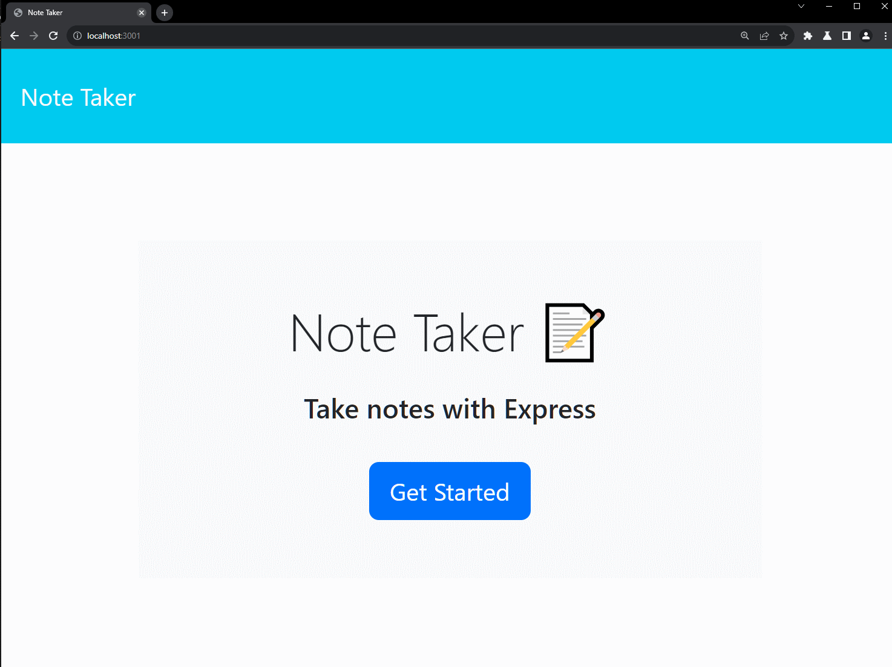
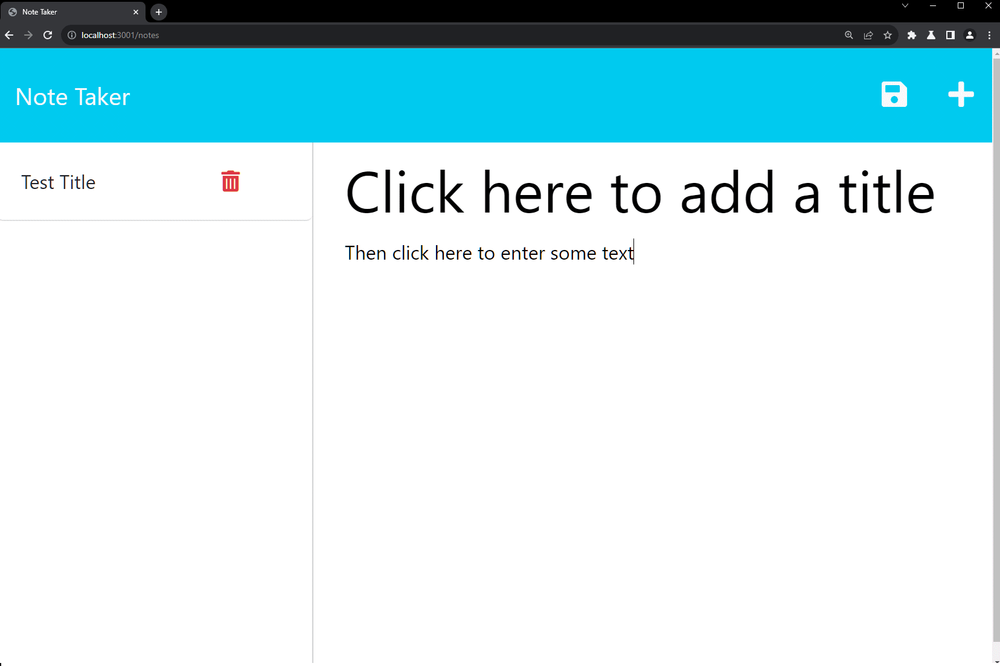
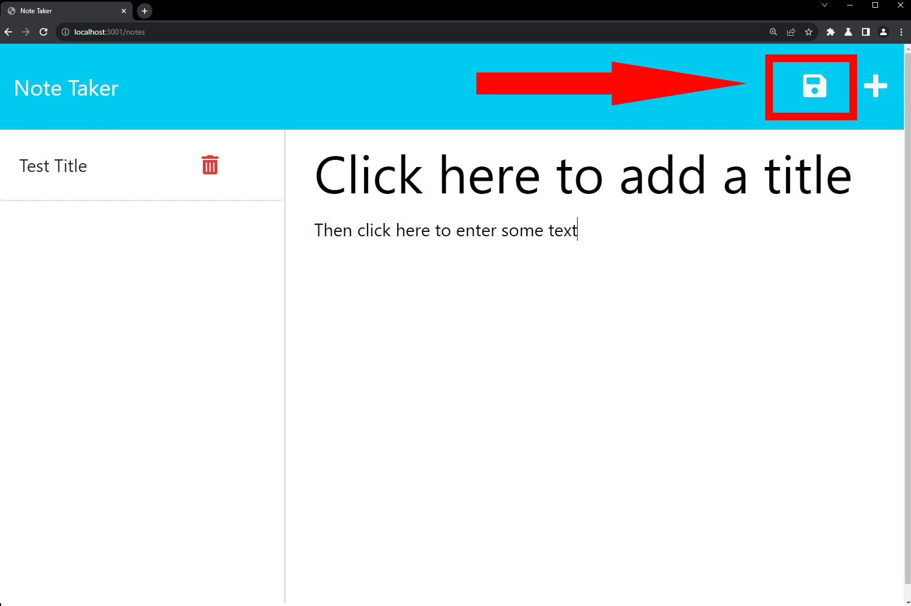
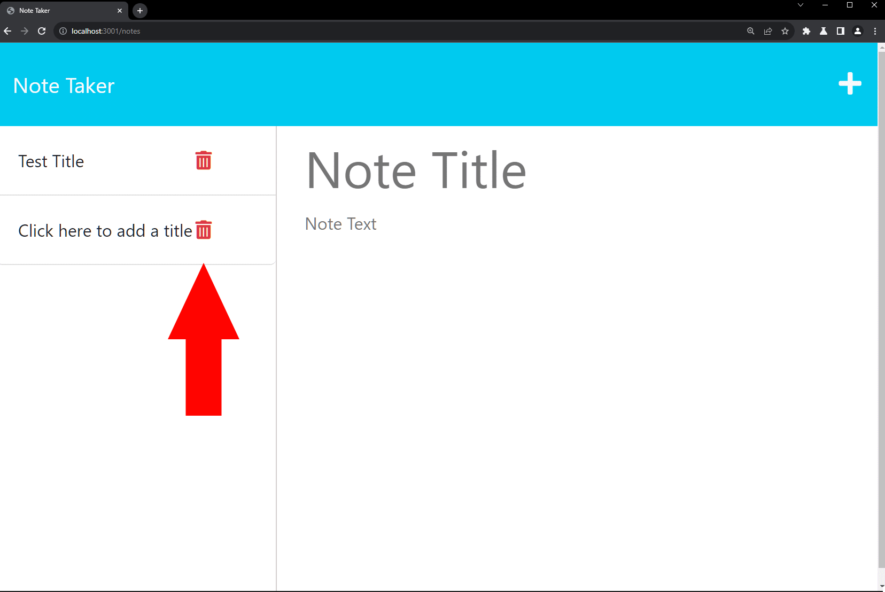

# Notify Express

## Description

This is a note taking application that can be used to write and save notes, using express.js to retrieve and write data to a json file.

## Table of Contents

-   [Installation](#installation)
-   [Usage](#usage)
-   [License](#license)
-   [How to Contribute](#contributing)
-   [Tests](#tests)
-   [Questions](#questions)

## Installation

-   Clone this repository to your local machine
-   Navigate to the root directory of the project in your terminal
-   Run `npm install` to install dependencies
-   Run `npm start` to start the server

## Usage

-   Navigate to `http://localhost:3001` in your browser
-   Click `Get Started` to begin
    
-   Click `Note Title` to enter a title for your note
-   Click `Note Text` to enter the body of your note
    
-   Click the save icon in the top right corner to save your note
    
-   Click on a saved note in the left hand column to view it
-   Click the + icon in the top right corner to clear the view and start creating a new note
-   Click the trash icon next to a saved note to delete it
    
-   Click `Note Taker` in the top left corner to return to the home page

## License

This project is licenced under [MIT License](https://choosealicense.com/licenses/mit)

## Contributing

This project is not currently seeking any collaborators

## Tests

This project does not currently implement any test functionality

## Questions

If you have any questions or concerns regarding this project my github profile can be located by using the following link
https://github.com/galvin-sh
